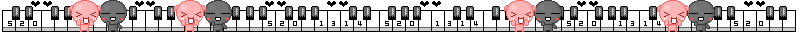

<div>
  <h3 align="center">"こんにちは、私はルカです。"</h3>
  <h3 align="center">よろしくお願いします。</h3>
</div>

<div align="center">

<a href="https://github.com/marketplace/actions/update-image-readme">
<!--START_SECTION:update_image-->

<!--END_SECTION:update_image-->
</a>

</div>

<br clear="both">

<h2> About 私自身 </h2>


```cpp
Profile Version: 4.0
--------------------
Level: 067
-----------
Codename: looka-info (ルカ・インフォ)
Identity: The Fool
Username: looka-info (ルカ・インフォ)
WhoamI: Frontend Engineer & Digital Designer

Fav_Subject: 
• Human Psychology
• Algorithmic Logic
• Behavioral Analysis
• Pattern Recognition
• Cognitive Science
Personality:
• Time reveals all.
-------------
Observe.
Understand.
Adapt.

The rest is only a matter of time.

```

<!--📏LINE-->


<h3 align="left">🛠 Language and Tools</h3>


<div align="center">

![][C++] ![][C] ![][Python] ![][JavaScript] ![][MySQL] ![][SQLite] ![][Markdown]  ![][Shell Script] ![][YAML] ![][Firebase] ![][Arduino] ![][Terraform] ![][AWS] ![][Anaconda] ![][Figma] ![][Bootstrap] ![][NPM] ![][CSS3] ![][HTML5]

</div>
<!--📏LINE-->

<h3>🔍 私の拠点</h3>

<div>
  
  <div align="center">

  ![][CodePen] ![][GitLab] ![][GitHub] ![][Git] ![][Gitpod] ![][DigitalOcean] ![][Github Pages] ![][Bitbucket] ![][Replit] ![][Stack Overflow] ![][Kaggle]

</div>

<!--📏LINE-->

<h3>🤖 AI/ML の 仕組み</h3>

<div>
  
  <div align="center">
  
  ![][PyTorch] ![][scikit-learn] ![][SciPy] ![][TensorFlow] ![][Keras] ![][Matplotlib] ![][NumPy] ![][Pandas] ![][Plotly]

</div>

<!--📏LINE-->

<h3>🚧 Work in Progress</h3>

![][Docker] ![][MongoDB] ![][nVIDIA] ![][React]  ![][TailwindCSS] ![][Vercel] ![][Raspberry Pi] ![][Zigbee]

[](https://github.com/looka-info/kuro.live)

[](https://github.com/looka-info/Looki---)

<!--📏LINE-->

<h3> 🔬 Currently Working on: </h3>

[](https://github.com/looka-info/makhlooq)

<!--📏LINE-->

<h3>📈 My Grinds </h>

###

<div>

<div align="center">

![][Hackerrank] ![][CodeChef] ![][GeeksForGeeks]
  
</div>

<div align="center"> 👀 </div>

|  |  |
| :--- | ---: |
|  |  |

<div align="center">
  <a href="https://github.com/kawarimidoll/typograssy">
        
  </a>
</div>

<div align="center">

[](https://git.io/streak-stats)

</div>
###

[](https://github.com/looka-info)

<div align="center">


</div>


###

<div align="center">
  
</div>

<br clear="both">
<div align="center">

  <a href="https://git.io/typing-svg"></a>

</div>

<div>

</div>


<!-- SHIELD GROUP -->

[C++]: https://img.shields.io/badge/c++-%2300599C.svg?style=for-the-badge&logo=c%2B%2B&logoColor=white
[C]: https://img.shields.io/badge/c-%2300599C.svg?style=for-the-badge&logo=c&logoColor=white
[Python]: https://img.shields.io/badge/python-3670A0?style=for-the-badge&logo=python&logoColor=ffdd54
[JavaScript]: https://img.shields.io/badge/javascript-%23323330.svg?style=for-the-badge&logo=javascript&logoColor=%23F7DF1E
[MySQL]: https://img.shields.io/badge/mysql-4479A1.svg?style=for-the-badge&logo=mysql&logoColor=white
[SQLite]: https://img.shields.io/badge/sqlite-%2307405e.svg?style=for-the-badge&logo=sqlite&logoColor=white
[Markdown]: https://img.shields.io/badge/markdown-%23000000.svg?style=for-the-badge&logo=markdown&logoColor=white
[Shell Script]: https://img.shields.io/badge/shell_script-%23121011.svg?style=for-the-badge&logo=gnu-bash&logoColor=white
[YAML]: https://img.shields.io/badge/yaml-%23ffffff.svg?style=for-the-badge&logo=yaml&logoColor=151515
[Firebase]: https://img.shields.io/badge/firebase-a08021?style=for-the-badge&logo=firebase&logoColor=ffcd34
[Arduino]: https://img.shields.io/badge/-Arduino-00979D?style=for-the-badge&logo=Arduino&logoColor=white
[Terraform]: https://img.shields.io/badge/terraform-%235835CC.svg?style=for-the-badge&logo=terraform&logoColor=white
[AWS]: https://img.shields.io/badge/AWS-%23FF9900.svg?style=for-the-badge&logo=amazon-aws&logoColor=white
[Anaconda]: https://img.shields.io/badge/Anaconda-%2344A833.svg?style=for-the-badge&logo=anaconda&logoColor=white
[Figma]: https://img.shields.io/badge/figma-%23F24E1E.svg?style=for-the-badge&logo=figma&logoColor=white
[Bootstrap]: https://img.shields.io/badge/bootstrap-%238511FA.svg?style=for-the-badge&logo=bootstrap&logoColor=white
[NPM]: https://img.shields.io/badge/NPM-%23CB3837.svg?style=for-the-badge&logo=npm&logoColor=white
[CSS3]: https://img.shields.io/badge/css3-%231572B6.svg?style=for-the-badge&logo=css3&logoColor=white
[HTML5]: https://img.shields.io/badge/html5-%23E34F26.svg?style=for-the-badge&logo=html5&logoColor=white

[CodePen]: https://img.shields.io/badge/Codepen-000000?style=for-the-badge&logo=codepen&logoColor=white
[GitLab]: https://img.shields.io/badge/gitlab-%23181717.svg?style=for-the-badge&logo=gitlab&logoColor=white
[GitHub]: https://img.shields.io/badge/github-%23121011.svg?style=for-the-badge&logo=github&logoColor=white
[Git]: https://img.shields.io/badge/git-%23F05033.svg?style=for-the-badge&logo=git&logoColor=white
[Gitpod]: https://img.shields.io/badge/gitpod-f06611.svg?style=for-the-badge&logo=gitpod&logoColor=white
[DigitalOcean]: https://img.shields.io/badge/DigitalOcean-%230167ff.svg?style=for-the-badge&logo=digitalOcean&logoColor=white
[Github Pages]: https://img.shields.io/badge/github%20pages-121013?style=for-the-badge&logo=github&logoColor=white
[Bitbucket]: https://img.shields.io/badge/bitbucket-%230047B3.svg?style=for-the-badge&logo=bitbucket&logoColor=white
[Replit]: https://img.shields.io/badge/Replit-DD1200?style=for-the-badge&logo=Replit&logoColor=white
[Stack Overflow]: https://img.shields.io/badge/-Stackoverflow-FE7A16?style=for-the-badge&logo=stack-overflow&logoColor=white
[Kaggle]: https://img.shields.io/badge/Kaggle-035a7d?style=for-the-badge&logo=kaggle&logoColor=white

[PyTorch]: https://img.shields.io/badge/PyTorch-%23EE4C2C.svg?style=for-the-badge&logo=PyTorch&logoColor=white
[scikit-learn]: https://img.shields.io/badge/scikit--learn-%23F7931E.svg?style=for-the-badge&logo=scikit-learn&logoColor=white
[SciPy]: https://img.shields.io/badge/SciPy-%230C55A5.svg?style=for-the-badge&logo=scipy&logoColor=%white
[TensorFlow]: https://img.shields.io/badge/TensorFlow-%23FF6F00.svg?style=for-the-badge&logo=TensorFlow&logoColor=white
[Keras]: https://img.shields.io/badge/Keras-%23D00000.svg?style=for-the-badge&logo=Keras&logoColor=white
[Matplotlib]: https://img.shields.io/badge/Matplotlib-%23ffffff.svg?style=for-the-badge&logo=Matplotlib&logoColor=black
[NumPy]: https://img.shields.io/badge/numpy-%23013243.svg?style=for-the-badge&logo=numpy&logoColor=white
[Pandas]: https://img.shields.io/badge/pandas-%23150458.svg?style=for-the-badge&logo=pandas&logoColor=white
[Plotly]: https://img.shields.io/badge/Plotly-%233F4F75.svg?style=for-the-badge&logo=plotly&logoColor=white

[Hackerrank]: https://img.shields.io/badge/-Hackerrank-2EC866?style=for-the-badge&logo=HackerRank&logoColor=white
[CodeChef]: https://img.shields.io/badge/CodeChef-%23964B00.svg?style=for-the-badge&logo=CodeChef&logoColor=white
[GeeksForGeeks]: https://img.shields.io/badge/GeeksforGeeks-gray?style=for-the-badge&logo=geeksforgeeks&logoColor=35914c

[Docker]: https://img.shields.io/badge/docker-%230db7ed.svg?style=for-the-badge&logo=docker&logoColor=white
[MongoDB]: https://img.shields.io/badge/MongoDB-%234ea94b.svg?style=for-the-badge&logo=mongodb&logoColor=white
[nVIDIA]: https://img.shields.io/badge/cuda-000000.svg?style=for-the-badge&logo=nVIDIA&logoColor=green
[React]: https://img.shields.io/badge/react-%2320232a.svg?style=for-the-badge&logo=react&logoColor=%2361DAFB
[TailwindCSS]: https://img.shields.io/badge/tailwindcss-%2338B2AC.svg?style=for-the-badge&logo=tailwind-css&logoColor=white
[Vercel]: https://img.shields.io/badge/vercel-%23000000.svg?style=for-the-badge&logo=vercel&logoColor=white
[Raspberry Pi]: https://img.shields.io/badge/-RaspberryPi-C51A4A?style=for-the-badge&logo=Raspberry-Pi
[Zigbee]: https://img.shields.io/badge/zigbee-%23EB0443.svg?style=for-the-badge&logo=zigbee&logoColor=white
